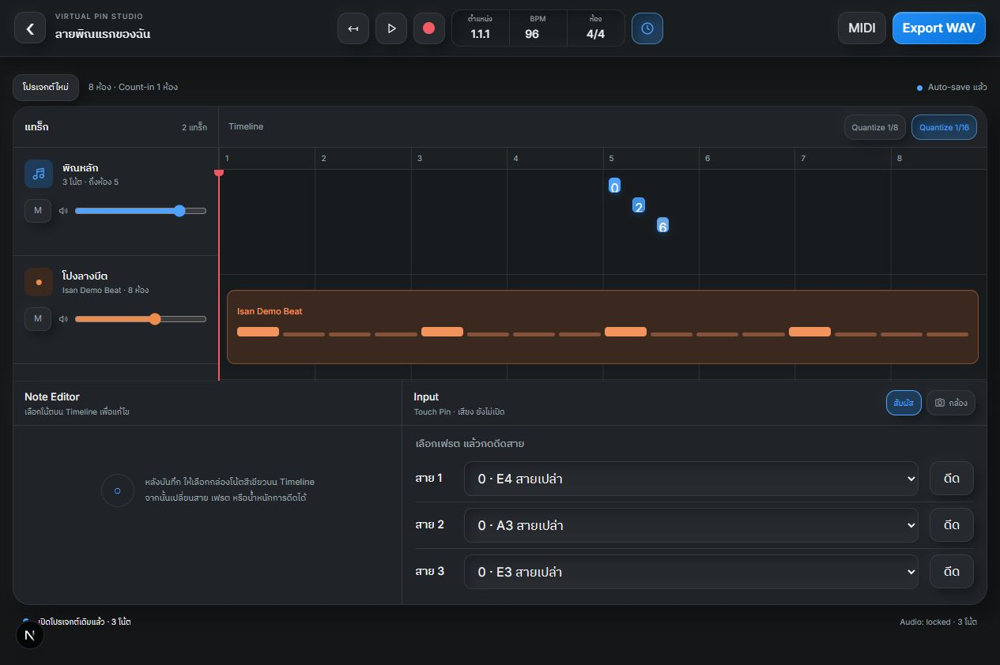
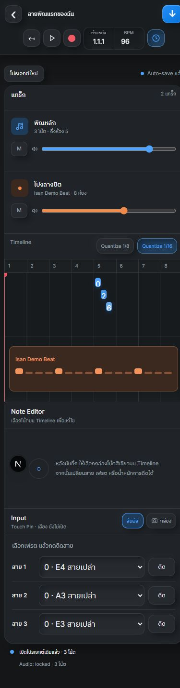

# Studio Mode MVP

หน้า `/studio` เป็นเวอร์ชันแรกสำหรับสาธิตกระบวนการสร้างเพลงจาก Virtual Phin โดยใช้โปรเจกต์คงที่ 8 ห้อง และบันทึกข้อมูลโน้ตเป็นสาย เฟรต จังหวะ และน้ำหนักการดีด

## Demo flow

1. กด `+ เพิ่ม Loop` เพื่อเพิ่ม Isan Demo Beat
2. กด Record และรอ Count-in 1 ห้อง
3. เล่นผ่าน Touch Phin หรือสลับไปใช้ Hand Tracking
4. กด Record อีกครั้งเพื่อหยุด แล้วเลือกโน้ตบน Timeline
5. เปลี่ยนสายหรือเฟรตใน Note Editor
6. กด `Quantize 1/8` หรือ `Quantize 1/16`
7. กด Play เพื่อตรวจผลงาน
8. Export เป็น `.wav` และ `.mid`

โปรเจกต์จะ Auto-save ในเบราว์เซอร์ด้วย `localStorage` ภายใต้ key `virtual-phin-studio-v1`

## หน้าจอที่ตรวจสอบ

